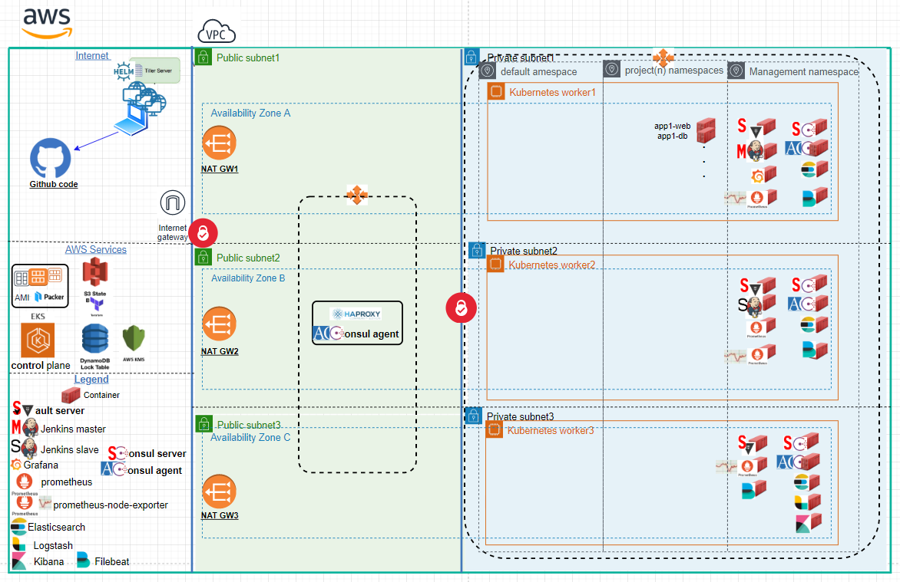

# devops-it-all
   
   ### As it say - try to devops it all:
   ##### Create automation environment using shell. python, ansible, terraform, helm, packer
   ##### Build on Amazon AWS VPC, EKS..
   ##### Build and run Jenkins devops-it-all apps common automation pipeline 
   ######      using https://github.com/ranhershko/devops-it-all-jenkinsfile repo
   ##### Using Hashicorp consul service discovery and vault manage secrets..
   ##### Build ELK stack for manage logs
   ##### Build Prometheus monitoring system and Grafana for querying and visualize metrics
        WORK IN PROGRESS...
   
   
   ### Prerequisite:
   ##### 1) Create an AWS Elastic IP named: haproxy_scale_eip
   ##### 2) Create a DNS wildcard record for this Elastic IP
   ##### 3) Create SSL wildcard certificate for this Dns wildcard record
   ##### 4) Github user email and ssh private key that used by this account
   ##### 5) Dockerhub account user and password 

   ### Running steps:
   ##### 1) git clone devops-it-all repo
   ##### 2) cd devops-it-all/ansible
   ##### 3) Environment build: 
   ##### Automatically: 
   ##### ../shell/run-devops-it-all.sh "Github ssh private key path" "Github account email" "Dockerhub user" "Dockerhub password"
   ##### Manually: (answer github & dockerhub login information)
   ##### ../shell/run-devops-it-all.sh
        
   ### When done: (destroy)
   ##### 1) cd devops-it-all
   ##### 2) ./shell/destroy_environment.sh
