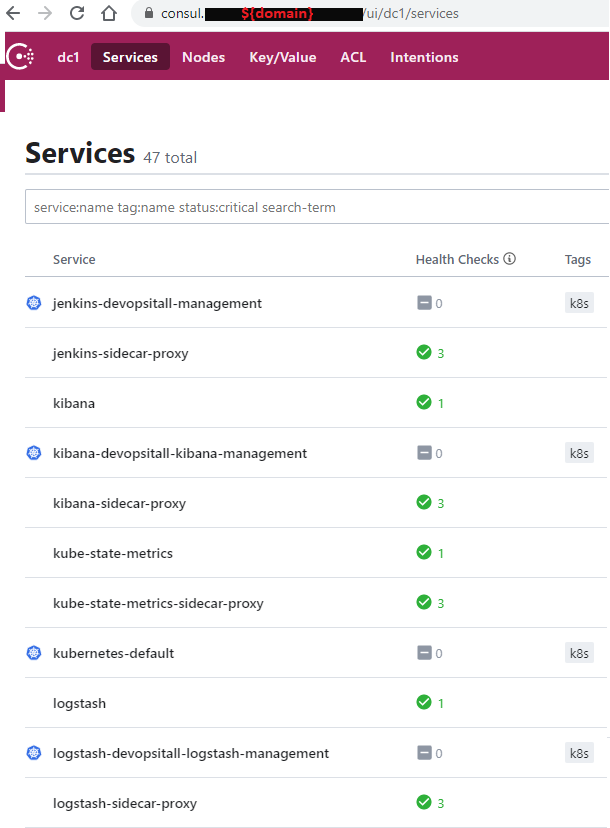

consul-cluster role
===================

Hashicorp Consul helm chart installation ansible role using ansible terraform module 

    WORK IN PROGRESS...

Requirements
------------

The Consul helm install from local devops-it-all/helm/consul dir 
Using: 
1) ansible terraform module
2) terraform helm provider

Example Playbook use
--------------------
    - hosts: servers
      roles:
         - role: consul-cluster

