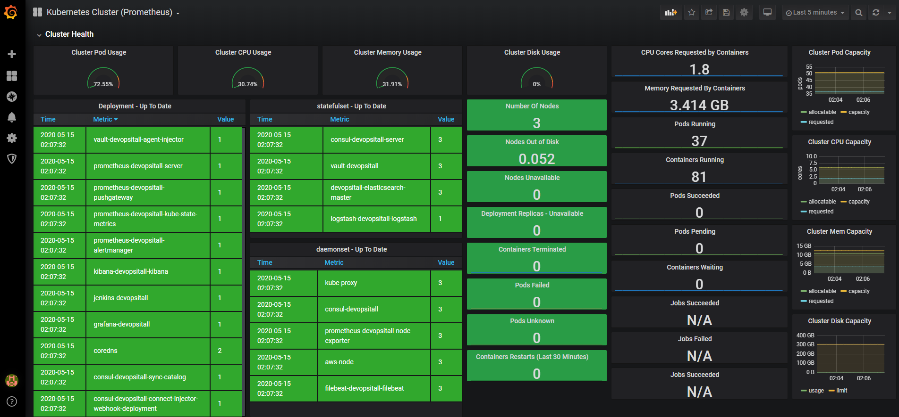

Grafana-env role
================

Grafana helm chart installation ansible role with kubernetes dashboard using ansible terraform module

    WORK IN PROGRESS...

Requirements
------------

The Grafana helm installation is done from local devops-it-all/helm/grafana dir
Using:
1) ansible terraform module
2) terraform helm provider

Example Playbook use
--------------------
    - hosts: servers
      roles:
        - role: grafana-env
