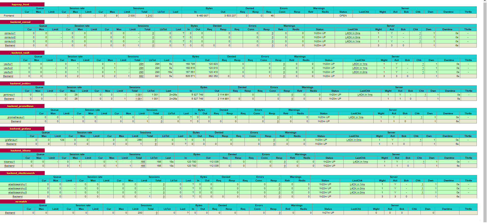

Grafana-env role
================

Haproxy installation ansible role with kubernetes management backend apps

    WORK IN PROGRESS...

Example Playbook use
--------------------
    - hosts: servers
      roles:
         - role: haproxy-lb

