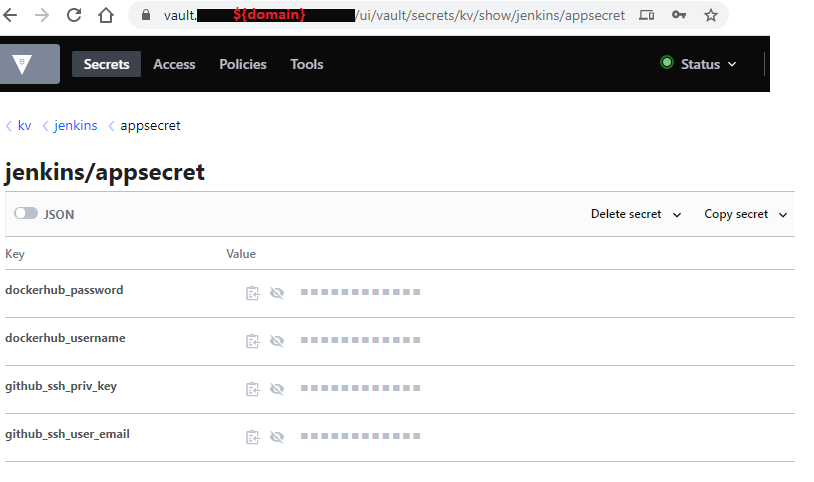
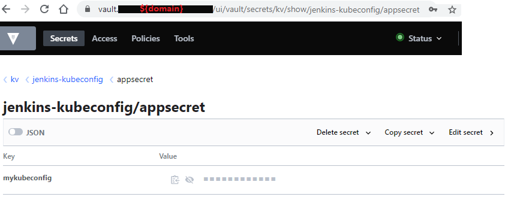

vault-cluster role
==================

Hashicorp Vault helm chart installation ansible role using ansible terraform module

    WORK IN PROGRESS...

Requirements
------------

The Vault helm install from local devops-it-all/helm/vault dir
Using:
1) ansible terraform module
2) terraform helm provider

Example Playbook use
--------------------
    - hosts: servers
      roles:
         - role: vault-cluster
